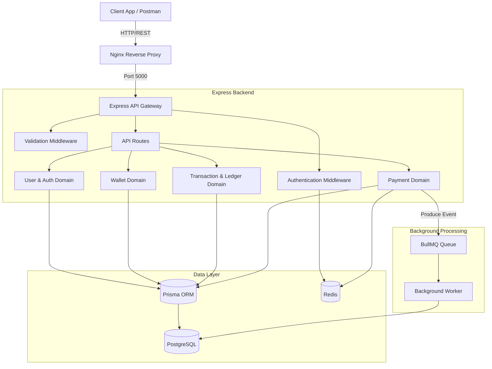
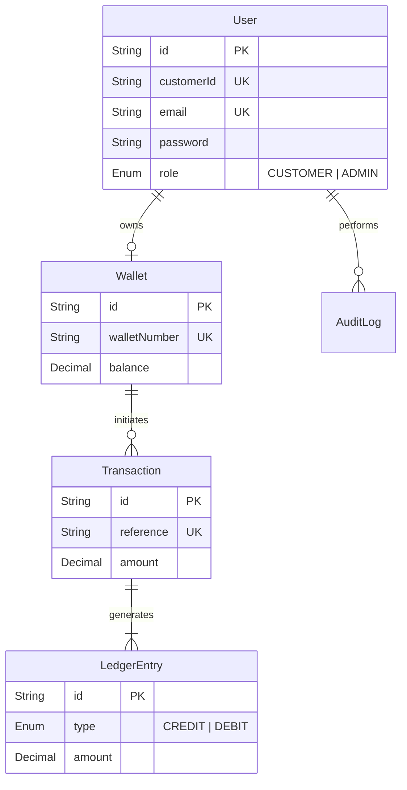

# Enterprise Banking Platform API

A modern, secure, and robust digital banking backend built on **Clean Architecture** and **Domain-Driven Modular Design**. Designed to handle strict financial integrity, asynchronous webhook payments, and distributed observability.

## Key Capabilities

- **Double-Entry Accounting**: Guarantees financial integrity by recording every balance change as paired debit and credit ledger entries. The ledger acts as the immutable system of record, while `Wallet.balance` serves as a read-optimized materialized cache.
- **Transaction Atomicity**: Wraps multi-step transfer sequences inside a single `prisma.$transaction()` block with row-level locks (`SELECT FOR UPDATE`), ensuring either all balance updates and ledger writes succeed, or the entire operation rolls back.
- **Payment Idempotency**: Prevents duplicate charges during retries by enforcing an `Idempotency-Key` header check backed by a Redis cache layer before initiating financial transactions.
- **Async Event Bus (BullMQ)**: Offloads non-critical, high-latency tasks (webhooks, notifications) to background workers, keeping the primary API response loop fast and decoupled.
- **Immutable Audit Logging**: Built-in tracking for admin interactions and system status changes.

---

## Architecture Blueprints

### System Architecture



### Database ER Diagram



For a deeper dive into architecture decisions, check our [ADR Documentation](docs/architecture/decisions.md) and [Sequence Diagrams](docs/architecture/sequence-diagrams.md).

---

## Tech Stack

- **Core**: Node.js & Express
- **Database ORM**: Prisma (v7.8.0)
- **Database**: PostgreSQL
- **Caching & Rate Limiting**: Redis
- **Background Jobs**: BullMQ
- **Validation**: Zod
- **Logger**: Winston (JSON structured with `X-Request-ID` correlation)
- **Documentation**: Swagger OpenAPI

---

## Setup & Running Instructions

### 1. Environment Configuration

Copy the example configuration to set up your `.env` file:
```bash
cp .env.example .env
```

**Required Environment Variables**:
- `DATABASE_URL`: Connection string for PostgreSQL.
- `REDIS_URL`: Connection string for Redis.
- `PORT`: Port the API binds to (default: `5000`).
- `JWT_SECRET`: Secret key for signing Access Tokens.
- `JWT_REFRESH_SECRET`: Secret key for signing Refresh Tokens.

### 2. Local Development

1. **Install dependencies**:
   ```bash
   npm install
   ```
2. **Apply database migrations**:
   ```bash
   npx prisma migrate dev
   ```
3. **Run the development server**:
   ```bash
   npm run dev
   ```

### 3. Production Deployment (Docker Compose)

To spin up the entire application stack (API, Background Worker, PostgreSQL, Redis, and Nginx proxy):

1. **Build and start the containers:**
   ```bash
   docker-compose up --build -d
   ```
2. **Verify Service Health:**
   ```bash
   curl http://localhost/health
   # Expected output: {"status":"UP","database":"UP","redis":"UP",...}
   ```
3. **View Logs (Winston JSON Structured output):**
   ```bash
   docker-compose logs -f bank-api
   ```
4. **Shutdown Gracefully:**
   ```bash
   docker-compose down
   ```

---

## Interactive API Documentation

Once the server is running, you can explore and test the endpoints via our Swagger UI:
- **URL**: `http://localhost:5000/api-docs` (or `http://localhost/api-docs` via Docker Nginx).

*We have also provided a full Postman Collection inside the [`postman/`](postman/) directory.*

---

## Automated QA & CI/CD

This platform enforces a strict Continuous Integration pipeline via **GitHub Actions** (`.github/workflows/ci.yml`).
On every PR and push to `main`, the pipeline automatically:
1. Provisions ephemeral Postgres and Redis containers.
2. Runs `eslint`.
3. Executes the integration test suite (`npm test`).
4. Verifies the multi-stage Docker build process.
