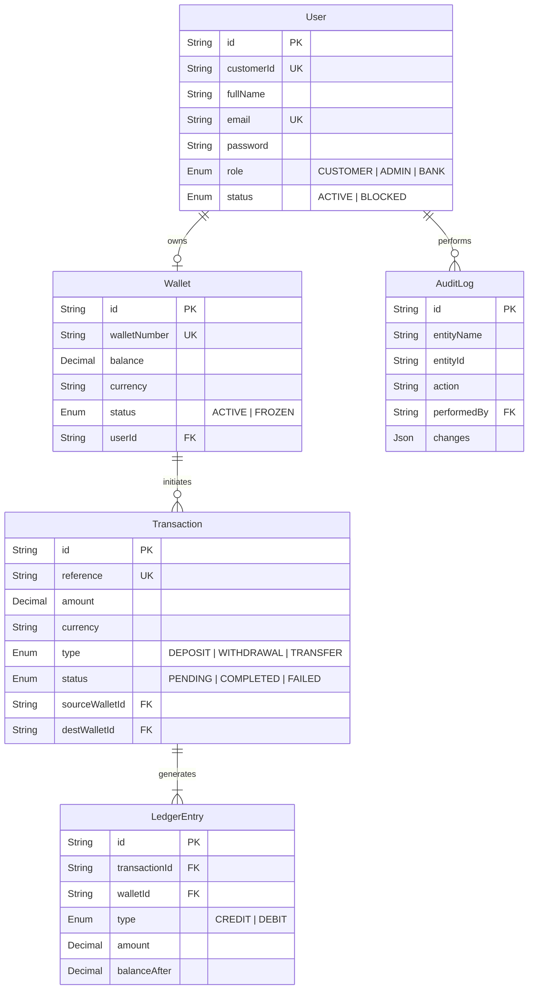

# Database Entity-Relationship Diagram

Our PostgreSQL database enforces strict referential integrity and is mapped via Prisma.

### Core Relationships
- **User ➔ Wallet**: A strict $1:1$ relationship. A user can have only one core wallet.
- **Transaction ➔ LedgerEntry**: A $1:N$ relationship (usually 2 entries per transaction to represent Double-Entry Accounting: one DEBIT and one CREDIT).
