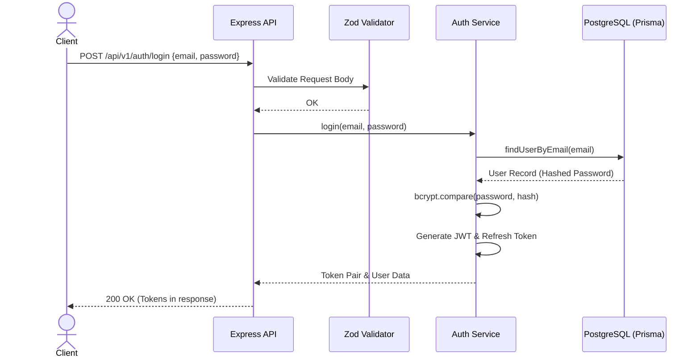
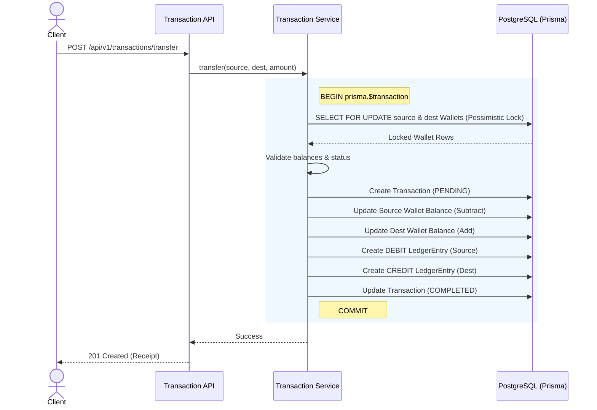
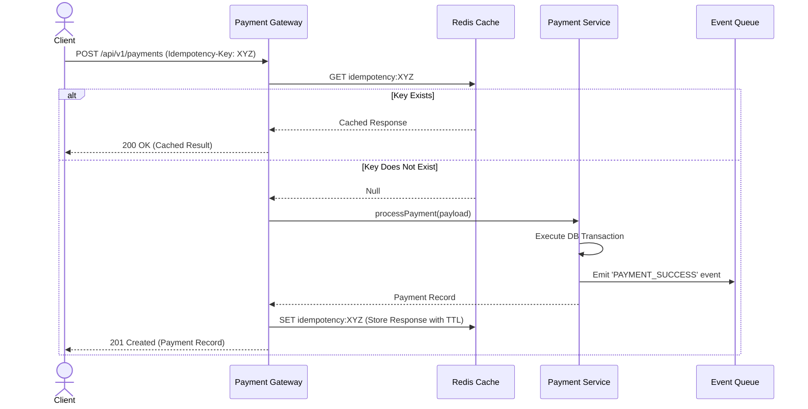

# Sequence Diagrams

## 1. Authentication & JWT Issuance

```mermaid
sequenceDiagram
    actor Client
    participant API as Express API
    participant Validator as Zod Validator
    participant Service as Auth Service
    participant DB as PostgreSQL (Prisma)

    Client->>API: POST /api/v1/auth/login {email, password}
    API->>Validator: Validate Request Body
    Validator-->>API: OK
    API->>Service: login(email, password)
    Service->>DB: findUserByEmail(email)
    DB-->>Service: User Record (Hashed Password)
    Service->>Service: bcrypt.compare(password, hash)
    Service->>Service: Generate JWT & Refresh Token
    Service-->>API: Token Pair & User Data
    API-->>Client: 200 OK (Tokens in response)
```

## 2. Atomic Money Transfer

```mermaid
sequenceDiagram
    actor Client
    participant API as Transaction API
    participant Service as Transaction Service
    participant DB as PostgreSQL (Prisma)

    Client->>API: POST /api/v1/transactions/transfer
    API->>Service: transfer(source, dest, amount)
    
    rect rgb(240, 248, 255)
        note right of Service: BEGIN prisma.$transaction
        Service->>DB: SELECT FOR UPDATE source & dest Wallets (Pessimistic Lock)
        DB-->>Service: Locked Wallet Rows
        
        Service->>Service: Validate balances & status
        Service->>DB: Create Transaction (PENDING)
        Service->>DB: Update Source Wallet Balance (Subtract)
        Service->>DB: Update Dest Wallet Balance (Add)
        
        Service->>DB: Create DEBIT LedgerEntry (Source)
        Service->>DB: Create CREDIT LedgerEntry (Dest)
        
        Service->>DB: Update Transaction (COMPLETED)
        note right of Service: COMMIT
    end
    
    Service-->>API: Success
    API-->>Client: 201 Created (Receipt)
```

## 3. Idempotent Payment Request Processing

```mermaid
sequenceDiagram
    actor Client
    participant API as Payment Gateway
    participant Redis as Redis Cache
    participant Service as Payment Service
    participant BullMQ as Event Queue

    Client->>API: POST /api/v1/payments (Idempotency-Key: XYZ)
    
    API->>Redis: GET idempotency:XYZ
    alt Key Exists
        Redis-->>API: Cached Response
        API-->>Client: 200 OK (Cached Result)
    else Key Does Not Exist
        Redis-->>API: Null
        API->>Service: processPayment(payload)
        Service->>Service: Execute DB Transaction
        Service->>BullMQ: Emit 'PAYMENT_SUCCESS' event
        Service-->>API: Payment Record
        
        API->>Redis: SET idempotency:XYZ (Store Response with TTL)
        API-->>Client: 201 Created (Payment Record)
    end
```
