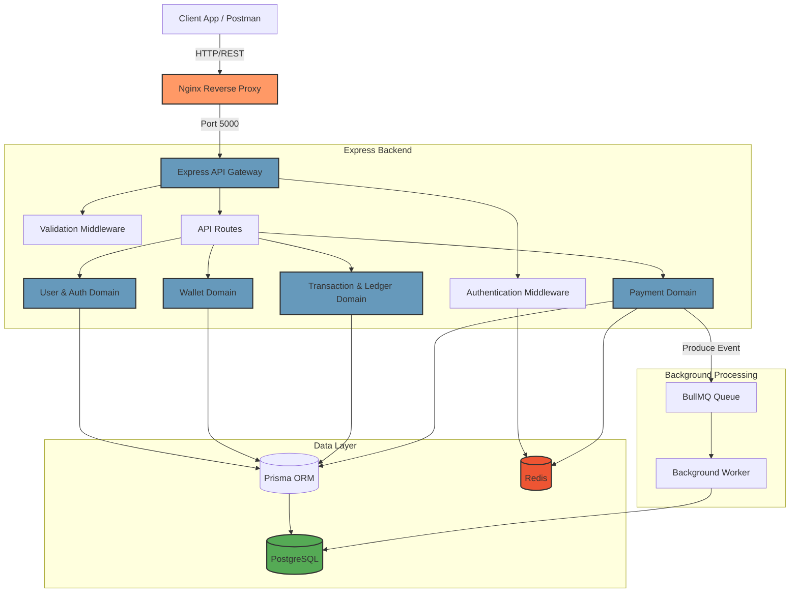

# System Architecture

The Banking Platform is built on a **Domain-Driven Modular Design** leveraging Node.js and Express, backed by PostgreSQL for transactional integrity and Redis for caching and rate limiting.

## High-Level Architecture Diagram

## Architectural Highlights
1. **Clean Architecture Layering**: Strict isolation between Controllers, Services, and Repositories.
2. **Double-Entry Accounting**: Transactions result in atomic double-entry records inside the Ledger.
3. **Event-Driven Workers**: High-latency webhooks and side-effects are decoupled using BullMQ.
